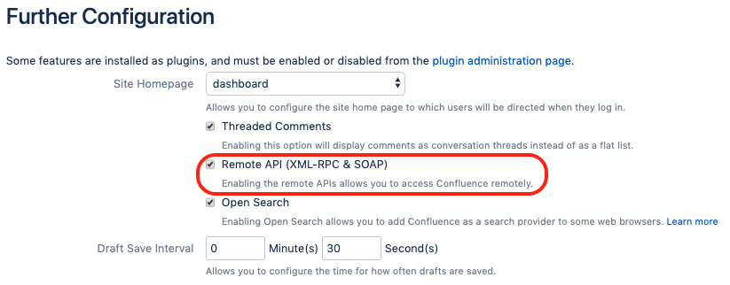

# Confluence Space Exporter

## Overview

Confluence Space Exporter is a handy command line tool that can export a Confluence space into XML or HTML or PDF file. A good use case is archiving space to an offsite storage. 

XML export includes almost everything in the existing space. To restore the space, you need to import the export file into a compatible Confluence server. This is the recommended export type.

PDF and HTML export only covers part of the contents in the space, the details can be found in the following table. The pro is obvious that the export file is immediately readble therefore easy for distribution. 

|Content|PDF export|XML export|HTML export|          
|-------------|-------------|-------------|-------------|
|Pages|Yes|Yes|Yes|
|Blogs|No|Yes|No|
|Comments|No|Optional|Optional|
|Attachments|Images only|Yes|Yes|
|Unpublished changes|No|Yes|No|
|Page numbers|Optional|N/A|N/A|

## Install 

```
npm i -g confluence-space-exporter
```

## Configuration
Enable Remote API (XML-RPC & SOAP) in Confluence server if you have not done it yet.



Setup the Confluence login information environment variables, please refer the [sample](./envvar).
```
source envvar
```

## Usage

```
Usage: confluence-space-exporter -k [key] -t [type]

Options:
  --help      Show help                                                [boolean]
  --version   Show version number                                      [boolean]
  -k, --key   Confluence space key                                    [required]
  -t, --type  Export file type: xml, html or pdf                      [required]

Examples:
  confluence-space-exporter -k CAP -t xml  Export Confluence space CAP to XML file
```

## Example

```
$ confluence-space-exporter -k SAN -t xml
Generating export file for space SAN ...
SAN space archiving file download link: http://localhost:8090/download/temp/Confluence-space-export-052036-20.xml.zip
SAN space download starting time: 2019-10-18 04:20:36 
Downloading...
status code is: 200
SAN space export file size: 0.38 MB
3.98 % has been downloaded for SAN
20.31 % has been downloaded for SAN
36.65 % has been downloaded for SAN
46.86 % has been downloaded for SAN
61.15 % has been downloaded for SAN
63.20 % has been downloaded for SAN
69.32 % has been downloaded for SAN
71.36 % has been downloaded for SAN
75.45 % has been downloaded for SAN
77.49 % has been downloaded for SAN
79.53 % has been downloaded for SAN
83.62 % has been downloaded for SAN
87.70 % has been downloaded for SAN
89.74 % has been downloaded for SAN
93.83 % has been downloaded for SAN
95.87 % has been downloaded for SAN
97.91 % has been downloaded for SAN
99.95 % has been downloaded for SAN
100.00 % has been downloaded for SAN
SAN space download finished! localhost-SAN-sandbox.xml.zip
SAN space download ending time: 2019-10-18 04:20:36
```

## Sample

[Sandbox space pdf export](./lib/sandbox.pdf)

